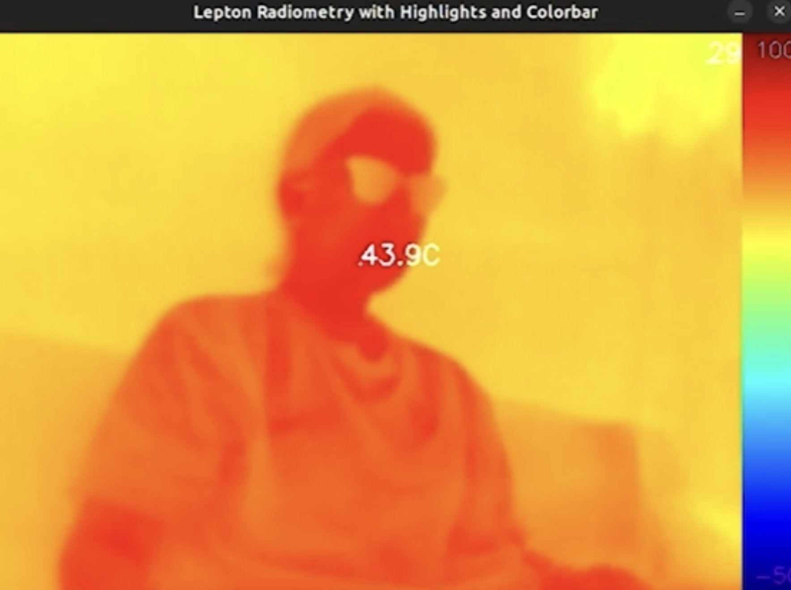

# Thermal Camera Setup and Testing Guide

This repository provides step-by-step instructions for setting up and using a thermal camera (e.g., FLIR Lepton) with the PureThermal 2 interface board. It includes preliminary validation exercises to ensure both hardware and software are correctly configured before running the final project. Additionally, this repository demonstrates the difference between:

- Normalization based on the range of detected temperatures (dynamic scaling based on scene conditions).
- Using the full possible temperature range from the camera (fixed scaling across all frames).

Furthermore, this repository provides multiple examples of applying predefined CV color maps, allowing users to customize thermal visualization for improved data collection.

---

## Features

- Real-time thermal video visualization.
- Highlights the hottest and coldest points in the frame, displaying their temperatures.
- A side **color bar** shows the temperature range.

---

## Requirements

### Hardware

- **PureThermal 2** interface board.
- **FLIR Lepton camera module**.
- A computer running **Linux** (tested on Ubuntu).

### Software

- **Python 3.x**.
- Required libraries:
  - `libuvc`.
  - `OpenCV`.
  - `numpy`.

---

## Step-by-Step Setup

### Step 1: Clone This Repository

Clone this repository to your local machine:

```bash
git clone https://github.com/Clarrainl/thermal-camera.git
cd thermal-camera
```

---

### Step 2: Install System Dependencies

Install the required libraries and dependencies:

```bash
sudo apt update
sudo apt install -y build-essential cmake libusb-1.0-0-dev libjpeg-dev python3-pip libgtk2.0-dev libgtk-3-dev python3-opencv
```

---

### Step 3: Clone and Build `libuvc`

Clone the `libuvc` repository and build it on your machine:

```bash
git clone https://github.com/groupgets/libuvc.git
cd libuvc
mkdir build && cd build
cmake ..
make
sudo make install
sudo ldconfig
```

**Expected result:** The `make` command should complete without errors, showing output like:

```
[100%] Built target uvc
```

---

### Step 4: Activate the Virtual Environment

A virtual environment has already been created in the `file` directory of this repository. To activate it, run:

```bash
cd file
source thermcam/bin/activate
```

This ensures all dependencies are properly installed and isolated for this project.

---

## Running the Final Project

### Step 5: Run the Final Scripts

#### 5.1 Outcome from the normalisation on the range of detected temperatures

Main script of 5.1 part is `uvc-radiometry-celsius.py`. Navigate to the directory and activate the environment before running:

```bash
cd file
source thermcam/bin/activate
sudo python3 uvc-radiometry-celsius.py
```

**Why normalizing?**

- Enhances contrast by dynamically scaling temperature values based on the detected range.
- Helps highlight subtle temperature variations within the current scene for better differentiation.

**Expected result:**

- The thermal image will be displayed in real-time.
- The hottest and coldest points will be highlighted in **red** and **blue**, respectively.
- Their temperatures will be displayed in white.
- A color bar on the right will indicate the temperature range.

Result 1: Person in the frame


Result 2: Lighter & Person in the frame


Result 3: Icecream & Person in the frame


Result 4: Icecream & Lighter & Person in the frame


Press `q` to exit the program.

---

#### 5.2 Outcome on the range of all possible values from camera

Main script of 5.1 part is `uvc_celsius_gradient_JET.py`. Navigate to the directory and activate the environment before running:

```bash
cd file
source thermcam/bin/activate
sudo python3 uvc-radiometry-celsius.py
```

**Why not normalizing?**
- Ensures consistency by maintaining a fixed temperature scale across all frames.
- Useful for comparative analysis when evaluating multiple scenes under different conditions.


**CV ColorMap**
To recolor your grayscale images to get a clue about them. OpenCV now comes with various colormaps to enhance the visualization in your computer vision application.

Script `uvc_celsius_gradient_JET.py` shows cv2.COLORMAP_JET color gradient (from blue to red), but you can play around differnet options. There are example files in this repository like:

- `uvc_celsius_gradient_PLASMA.py`
- `uvc_celsius_gradient_SPRING.py`
- `uvc_celsius_gradient_VIRIDIS.py`

But you can also check other available [ColorMaps in OpenCV](https://docs.opencv.org/4.5.4/d3/d50/group__imgproc__colormap.html#gga9a805d8262bcbe273f16be9ea2055a65a61e4747e35b5775ea2ca27ac1484ad94)

**Expected result:**

- The thermal image will be displayed in real-time.
- The hottest and coldest points will be highlighted in **red** and **blue**, respectively.
- Their temperatures will be displayed in white.
- A color bar on the right will indicate the temperature range.

**`uvc_celsius_gradient_JET.py`**

Result 1.1: Person in the frame

Result 1.2 Icecream & Lighter & Person in the frame


**`uvc_celsius_gradient_PLASMA.py`**

Result 2.1: Person in the frame

Result 2.2 Icecream & Lighter & Person in the frame


**`uvc_celsius_gradient_SPRING.py`**

Result 2.1: Person in the frame

Result 2.2 Icecream & Lighter & Person in the frame


**`uvc_celsius_gradient_VIRIDIS.py`**

Result 2.1: Person in the frame

Result 2.2 Icecream & Lighter & Person in the frame


## Troubleshooting

### **Issue: **

1. Ensure the camera is properly connected.
2. Verify detection with:
   ```bash
   ls /dev/video*
   ```

If no device appears, check the USB connection.

---

### **Issue: OpenCV Errors**

If you encounter errors like:

- *The function is not implemented.*
- *Cannot query video position.*

Ensure OpenCV is installed via:

```bash
sudo apt update
sudo apt install python3-opencv
```

---

## Repository Structure

```
thermal-camera-project/
├── README.md                   # Documentation
├── LICENSE                     # License information
├── file/                       # Main directory for scripts and virtual environment
│   ├── thermcam/               # Virtual environment for the project
│   ├── uvc_celsius_gradient_JET.py       # All values with JET ColorMap
│   ├── uvc_celsius_gradient_PLASMA.py       # All values with PLASMA ColorMap
│   ├── uvc_celsius_gradient_SPRING.py       # All values with SPRING ColorMap
│   ├── uvc_celsius_gradient_VIRIDIS.py       # All values with VIRIDIS ColorMap
│   ├── uvc-deviceinfo.py       # Camera info script
│   ├── uvc-radiometry.py       # Basic thermal data stream
│   └── uvc-radiometry-celsius.py # Normalized values
```

---

## Credits

- [libuvc](https://github.com/groupgets/libuvc)
- [OpenCV](https://opencv.org/)

## Authors
  - [Clarrainl](https://github.com/Clarrainl)
  - [j-albo](https://github.com/j-albo)
  - [Mauweberla](https://github.com/Mauweberla)


<!--  DO NOT REMOVE
-->
#### Acknowledgements

- Creation of GitHub template: [Marita Georganta](https://www.linkedin.com/in/marita-georganta/) - Robotic Sensing Expert
- Creation of MRAC-IAAC GitHub Structure: [Huanyu Li](https://www.linkedin.com/in/huanyu-li-457590268/) - Robotic Researcher


